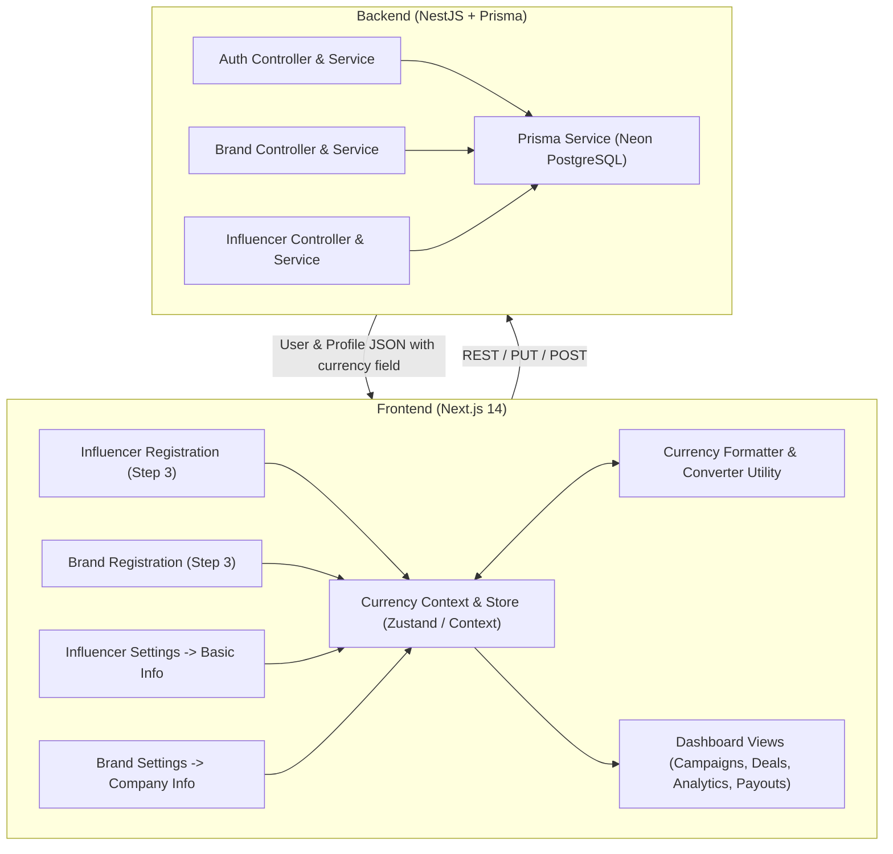

# Technical Requirements Document (TRD): Platform-Wide Currency Localization & Management

**Document ID:** TRD-2026-CURR-001  
**Status:** Draft / Ready for Review  
**Target Platform:** Zerify Monorepo (`apps/backend`, `apps/frontend`, `packages/types`, `packages/shared-utils`)  
**Base / Default Currency:** Indian Rupee (`INR` / `₹`)  
**Secondary Supported Currency:** US Dollar (`USD` / `$`)  

---

## 1. Executive Summary & Objective

Zerify is localizing its primary transactional, pricing, and budgeting baseline to the **Indian Rupee (`INR` / `₹`)** by default across all client applications and backend services. 

### Core Goals:
1. **Rupee Default Across Platform:** Ensure that Indian Rupee (`INR` / `₹`) is the platform-wide default for all unregistered visitors, new signups, legacy users with unconfigured currency, and fallback states.
2. **Influencer Registration Flow (Image 1):** Add an intuitive currency selector (`₹ INR` default vs `$ USD`) in the creator registration step. Dynamically adjust the "Rate Per Reel" slider ranges, ticks, steps, and real-time formatting according to the selected currency.
3. **Brand Registration Flow (Image 2):** Add a currency selector (`₹ INR` default vs `$ USD`) in the brand registration step. Dynamically adjust the "Monthly Creator Budget" slider ranges, ticks, steps, and real-time formatting according to the selected currency.
4. **Basic Info Settings Section (`/dashboard?tab=settings`):** Add a dedicated **"Preferred Platform Currency"** field in the **Basic Info** section for both **Influencers** (`BasicInfoTab` / `SingleBasicInfoCard`) and **Brands** (`BrandCompanyInfoTab`).
5. **Universal State Persistence & Synchronization:** When a user sets or updates their preferred currency (during registration or in settings), this selection must automatically persist in the database, synchronize into local cache/store, and drive consistent currency symbols, formatting, and conversion values across all views (Campaign Discovery, Applications, Offers, Deliverables, Analytics, Payouts, and Settings).
6. **Graceful Backward Compatibility:** Existing users in the database with empty or legacy currency fields will automatically resolve to `INR`.

---

## 2. Architecture & Data Flow Overview



---

## 3. Database Schema Specifications (Prisma ORM)

### 3.1 Schema Modifications (`schema.prisma`)

1. **`BrandProfile` Model**:
   - Add `currency String? @default("INR")`
2. **`InfluencerProfile` Model**:
   - Update default of `currency String? @default("INR")` (previously `"USD"`).
3. **`Campaign` Model**:
   - Update default of `budgetCurrency String? @default("INR")` (previously `"USD"`).
4. **`CampaignApplication` Model**:
   - Update default of `proposedCurrency String? @default("INR")` (previously `"USD"`).
5. **`CampaignOffer` Model**:
   - Update default of `compensationCurrency String @default("INR")` (previously `"USD"`).
6. **`CampaignParticipant` Model**:
   - Update default of `agreedCurrency String @default("INR")` (previously `"USD"`).
7. **`CampaignPayment` Model**:
   - Update default of `currency String @default("INR")` (previously `"USD"`).

```prisma
// Example Prisma Schema Diff
model BrandProfile {
  id                    String         @id @default(uuid())
  userId                String         @unique
  user                  User           @relation(fields: [userId], references: [id], onDelete: Cascade)
  companyName           String?
  logoUrl               String?
  website               String?
  industry              String?
  location              String?
  description           String?
  foundedYear           String?
  socialLinks           Json?
  brandValues           String[]       @default([])
  campaignBudget        String?
  currency              String?        @default("INR") // <-- NEW: Default INR
  // ... other fields
}

model InfluencerProfile {
  id                      String                        @id @default(uuid())
  userId                  String                        @unique
  user                    User                          @relation(fields: [userId], references: [id], onDelete: Cascade)
  handle                  String?
  bio                     String?
  location                String?
  // ...
  minPricePerReel         Float?
  currency                String?                       @default("INR") // <-- UPDATED: Default INR
  pricingRange            String?
  // ... other fields
}
```

### 3.2 Database Migration & Data Backfill Strategy
- **Migration Execution:** Use `npx prisma db push --skip-generate` to safely apply the schema update to Neon PostgreSQL.
- **Legacy Backfill Query:** Ensure all existing brand and influencer records with null or default values are normalized:
```sql
UPDATE "brand_profiles" SET "currency" = 'INR' WHERE "currency" IS NULL OR "currency" = '';
UPDATE "influencer_profiles" SET "currency" = 'INR' WHERE "currency" IS NULL OR "currency" = '' OR "currency" = 'USD';
UPDATE "campaigns" SET "budgetCurrency" = 'INR' WHERE "budgetCurrency" IS NULL OR "budgetCurrency" = '';
```

---

## 4. Backend API & DTO Specifications (NestJS)

### 4.1 Authentication DTOs (`apps/backend/src/modules/auth/dto/`)

#### 1. `RegisterBrandDto` (`register-brand.dto.ts`)
```typescript
export class RegisterBrandDto {
  @IsEmail({}, { message: 'Please provide a valid business email address' })
  email: string;

  @IsString()
  @MinLength(6, { message: 'Password must be at least 6 characters long' })
  password: string;

  @IsString()
  name: string;

  @IsString()
  @IsOptional()
  companyName?: string;

  @IsString()
  @IsOptional()
  website?: string;

  @IsString()
  @IsOptional()
  currency?: string; // <-- 'INR' | 'USD' (Defaults to 'INR')

  @IsOptional()
  budget?: number;
}
```

#### 2. `RegisterInfluencerDto` (`register-influencer.dto.ts`)
```typescript
export class RegisterInfluencerDto {
  // ... existing fields
  @IsString()
  @IsOptional()
  currency?: string; // <-- 'INR' | 'USD' (Defaults to 'INR')

  @IsOptional()
  minPricePerReel?: number;
}
```

### 4.2 Brand & Influencer Profile DTOs

#### 1. `UpdateBrandCompanyInfoDto` (`apps/backend/src/modules/brand/dto/brand-profile.dto.ts`)
```typescript
export class UpdateBrandCompanyInfoDto {
  // ... existing companyName, logoUrl, website, industry, location, etc.
  @ApiPropertyOptional({ example: 'INR' })
  @IsOptional()
  @IsString()
  currency?: string; // <-- 'INR' | 'USD'
}
```

#### 2. `UpdateInfluencerProfileDto` (`apps/backend/src/modules/influencer/dto/update-profile.dto.ts`)
```typescript
export class UpdateInfluencerProfileDto {
  // ... existing name, handle, bio, location, etc.
  @IsOptional()
  @IsString()
  currency?: string; // <-- 'INR' | 'USD'
}
```

### 4.3 Repository Updates (`auth.repository.ts`, `brand.repository.ts`, `influencer.repository.ts`)
- In `createBrandUser`: populate `currency: dto.currency || 'INR'` into `BrandProfile`.
- In `createInfluencerUser`: populate `currency: dto.currency || 'INR'` into `InfluencerProfile`.
- In `updateCompanyInfo` / `updateProfile`: persist `currency` update and return sanitized response.

---

## 5. Frontend Architecture & Shared Utilities (`apps/frontend`)

### 5.1 Currency State Management (`CurrencyContext` / Store)

A centralized React Context and LocalStorage synchronization store:
- **Location:** `apps/frontend/src/context/CurrencyContext.tsx` or Zustand store.
- **Hierarchy of Resolution:**
  1. `user.brandProfile.currency` / `user.influencer.currency` (from DB)
  2. `localStorage.getItem('zerify_preferred_currency')`
  3. Default fallback: `'INR'`

```typescript
export type SupportedCurrency = 'INR' | 'USD';

export interface CurrencyConfig {
  code: SupportedCurrency;
  symbol: string;
  name: string;
  exchangeRateToINR: number; // 1 USD = ~83.5 INR
}

export const CURRENCY_CONFIG: Record<SupportedCurrency, CurrencyConfig> = {
  INR: {
    code: 'INR',
    symbol: '₹',
    name: 'Indian Rupee',
    exchangeRateToINR: 1,
  },
  USD: {
    code: 'USD',
    symbol: '$',
    name: 'US Dollar',
    exchangeRateToINR: 83.5,
  },
};
```

### 5.2 Formatting & Conversion Helper Functions (`@/utils/currency.ts` or `@zerify/shared-utils`)

```typescript
/**
 * Formats a monetary amount into a clean, localized string.
 * e.g., formatCurrency(2500, 'INR') => "₹2,500"
 *       formatCurrency(2500, 'USD') => "$2,500"
 */
export function formatCurrency(
  amount: number | string | null | undefined,
  currency: SupportedCurrency = 'INR',
  options?: { compact?: boolean; showDecimals?: boolean }
): string;

/**
 * Converts value between INR and USD using the exchange rate baseline.
 */
export function convertCurrency(
  amount: number,
  from: SupportedCurrency,
  to: SupportedCurrency
): number;
```

---

## 6. UI & Component Specifications

### 6.1 Influencer Registration (`RegisterInfluencerStep.tsx` — Image 1)

1. **Currency Toggle Selector:**
   - Positioned cleanly directly above the "Rate Per Reel / Video" card or in the slider header.
   - Styled with glassmorphism tabs: `[ ₹ INR ]` (Active gradient) | `[ $ USD ]`.
2. **Dynamic Range Slider Parameters:**
   - **When Currency = `INR` (Default):**
     - Min: `₹0`
     - Max: `₹5,00,000`
     - Step: `₹1,000` (or `₹5,000` for high values)
     - Default Value: `₹20,000`
     - Ticks: `₹0` | `₹50,000` | `₹2,50,000` | `₹5,00,000+`
     - Display: `₹20,000 / reel` (with conversion helper hint: `~$240`)
   - **When Currency = `USD`:**
     - Min: `$0`
     - Max: `$5,000`
     - Step: `$50`
     - Default Value: `$250`
     - Ticks: `$0` | `$500` | `$2,500` | `$5,000+`
     - Display: `$250 / reel` (with conversion helper hint: `~₹20,875`)
3. **Payload Submission:** Pass `currency: selectedCurrency` and `minPricePerReel: pricePerReel` to `/auth/influencer/register`.

### 6.2 Brand Registration (`RegisterBrandStep.tsx` — Image 2)

1. **Currency Toggle Selector:**
   - Positioned in the "Monthly Creator Budget" section.
   - Segmented toggle: `[ ₹ INR (Default) ]` and `[ $ USD ]`.
2. **Dynamic Budget Slider Parameters:**
   - **When Currency = `INR` (Default):**
     - Min: `₹0`
     - Max: `₹25,00,000`
     - Step: `₹25,000`
     - Default Value: `₹5,00,000`
     - Ticks: `₹0` | `₹5,00,000` | `₹15,00,000` | `₹25,00,000+`
     - Display: `₹5,00,000 / month` (with secondary hint `~$5,988`)
   - **When Currency = `USD`:**
     - Min: `$0`
     - Max: `$25,000`
     - Step: `$500`
     - Default Value: `$7,000`
     - Ticks: `$0` | `$5,000` | `$15,000` | `$25,000+`
     - Display: `$7,000 / month`
3. **Payload Submission:** Pass `currency: selectedCurrency` and `budget: budget` to `/auth/brand/register`.

---

### 6.3 Settings Page (`http://localhost:3000/dashboard?tab=settings`)

#### 1. Influencer Basic Info Tab (`SingleBasicInfoCard.tsx` / `BasicInfoTab.tsx`)
- Add a new form field in the 2-column grid layout: **"Preferred Currency"**.
- Component: `CustomSelect` with options:
  - `{ value: 'INR', label: '₹ INR (Indian Rupee)', icon: '₹' }`
  - `{ value: 'USD', label: '$ USD (US Dollar)', icon: '$' }`
- On saving Basic Info:
  - Send `currency: selectedCurrency` in `PUT /influencer/profile`.
  - Update `zerify_influencer_profile_cache` and `zerify_preferred_currency` in `localStorage`.
  - Dispatch `zerify_influencer_profile_update` and `zerify_currency_change` events to trigger immediate UI refresh across all tabs.

#### 2. Brand Company Info Tab (`BrandCompanyInfoTab.tsx`)
- Add a **"Preferred Currency"** field in the 2-column company information grid (e.g., alongside Industry Sector / HQ Location).
- Component: `CustomSelect` with INR and USD options.
- On saving Company Info:
  - Send `currency: selectedCurrency` in `PUT /brand/company-info`.
  - Update `zerify_brand_profile_cache` and `zerify_preferred_currency` in `localStorage`.
  - Dispatch `zerify_brand_profile_update` and `zerify_currency_change` events.

---

## 7. Platform-Wide View Audit & Display Rules

| Screen / View | Current Display | Target Display Behavior |
|---|---|---|
| **Campaign Discovery Cards** | Fixed `$500 - $1,500` | Formats according to `budgetCurrency` with automatic dynamic conversion to viewer's preferred currency (e.g., `₹40,000 - ₹1,20,000` / `~$500 - $1,500`). |
| **Active Campaigns & KPI Bars** | Hardcoded `$Total Spend / Escrow` | Formats in user's chosen currency (`₹` for INR, `$` for USD). |
| **Creator Rate Cards & Discovery** | `$250 / reel` | Displays `₹20,000 / reel` if creator set INR, or dynamically converts based on brand viewer's currency preference. |
| **Campaign Pitch & Offer Modals** | Hardcoded `$` inputs | Dynamic currency input selector with default matching the campaign/brand currency. |
| **Brand Payouts & Escrow Tab** | Hardcoded `$ Escrow Wallet` | Shows `₹ INR` balances with multi-currency conversion preview. |
| **Pricing Preferences Tab** | Hardcoded USD select | Defaults select to `₹ INR` with option to switch to `$ USD`. |

---

## 8. Non-Functional Requirements & Edge Cases

1. **Zero / Barter Values:**
   - If price or budget is `0`: Display `₹0 (Product Gifting / Barter)` or `$0 (Product Gifting / Barter)`.
2. **Exchange Rate Drift:**
   - Use a standardized static rate config (`1 USD = 83.5 INR`) for Phase 1 UI approximations, architected to allow dynamic API rate fetching in Phase 2.
3. **Number Formatting Localization:**
   - INR amounts format using the Indian numbering system (`1,00,000` for 1 Lakh) via `Intl.NumberFormat('en-IN')`.
   - USD amounts format using standard Western notation (`100,000`) via `Intl.NumberFormat('en-US')`.
4. **Offline / Unauthenticated Fallback:**
   - Public landing pages and unauthenticated screens default strictly to `INR` (`₹`).

---

## 9. Implementation Plan & Phase Breakdown

| Phase | Milestone | Scope / Deliverables |
|---|---|---|
| **Phase 1** | **Database & API DTOs** | Update Prisma schema defaults to `INR`, execute `prisma db push`, update backend DTOs & repositories for auth, brand, and influencer modules. |
| **Phase 2** | **Currency Store & Utility** | Build `formatCurrency`, `convertCurrency`, and `CurrencyContext` in frontend shared utilities. |
| **Phase 3** | **Registration Flows** | Update `RegisterInfluencerStep.tsx` and `RegisterBrandStep.tsx` with currency toggles and responsive dynamic sliders. |
| **Phase 4** | **Settings Tab Localization** | Add Currency selector to `SingleBasicInfoCard.tsx` (influencer) and `BrandCompanyInfoTab.tsx` (brand). |
| **Phase 5** | **Platform-Wide Audit & Polish** | Audit Campaign Discovery, Deal/Offer Modals, KPI cards, and Analytics to ensure seamless `INR` default rendering and instantaneous currency switching. |

---

## 10. Verification & Acceptance Criteria

1. **New Influencer Sign-up:**
   - Navigating to Creator Registration step 3 shows `₹ INR` selected by default with slider range `₹0` to `₹5,00,000+`.
   - Switching to `$ USD` dynamically converts and reconfigures the slider to `$0` to `$5,000+`.
   - Creating account persists the selected currency in `influencer_profiles` table.
2. **New Brand Sign-up:**
   - Navigating to Brand Registration step 3 shows `₹ INR` selected by default with budget range `₹0` to `₹25,00,000+`.
   - Switching to `$ USD` reconfigures the budget slider to `$0` to `$25,000+`.
   - Creating account persists the currency in `brand_profiles` table.
3. **Settings Page:**
   - Navigating to `/dashboard?tab=settings` shows the Currency field in Basic Info for both Brand and Influencer.
   - Changing the currency from `INR` to `USD` (or vice versa) and clicking Save persists to DB and immediately updates currency displays across all sidebar KPIs, header metrics, and discovery cards without requiring a hard refresh.
4. **Legacy Users / Fallback:**
   - Accounts with existing data or null currency automatically render `₹ INR`.
