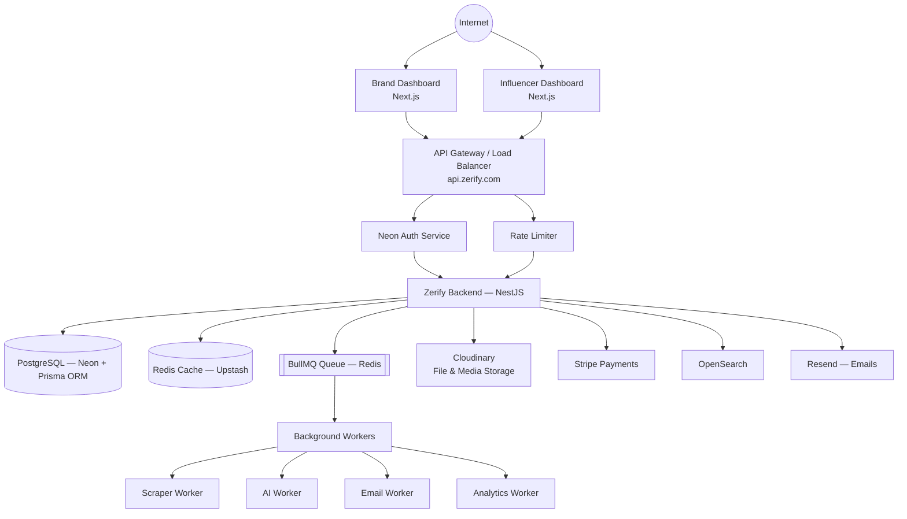
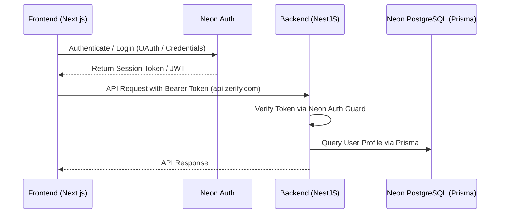
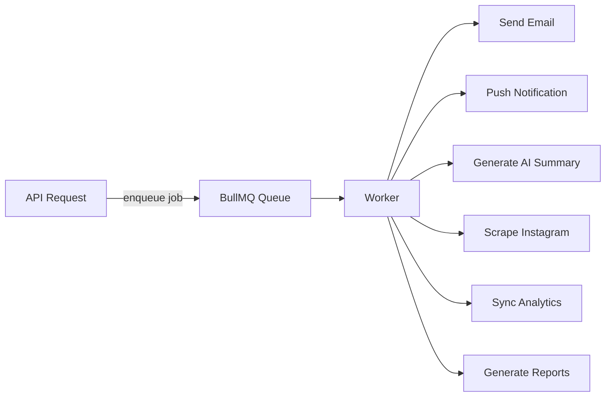
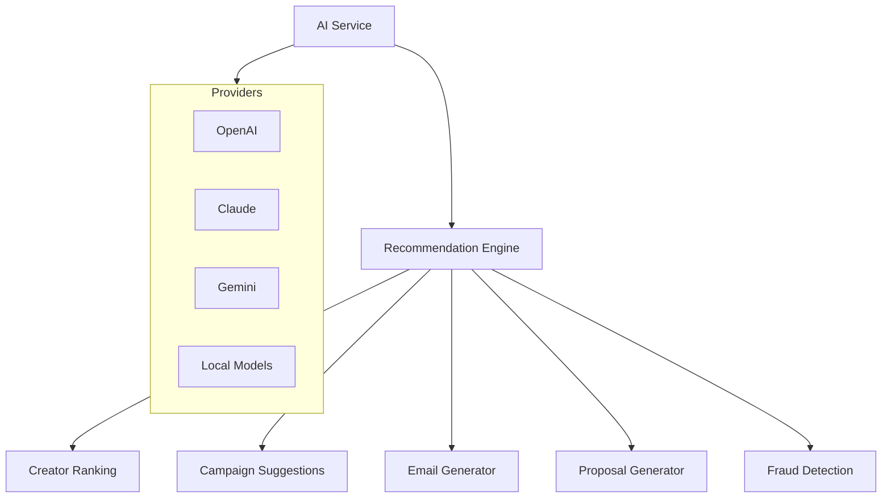
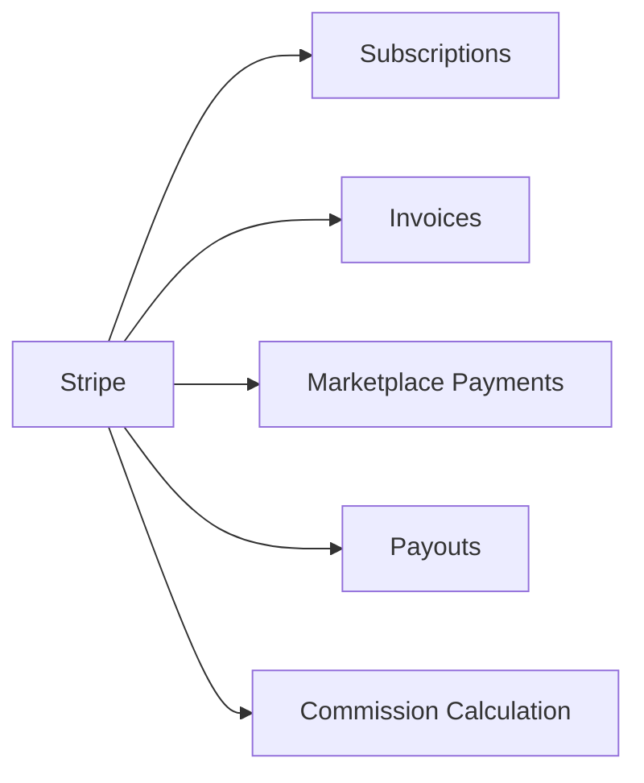
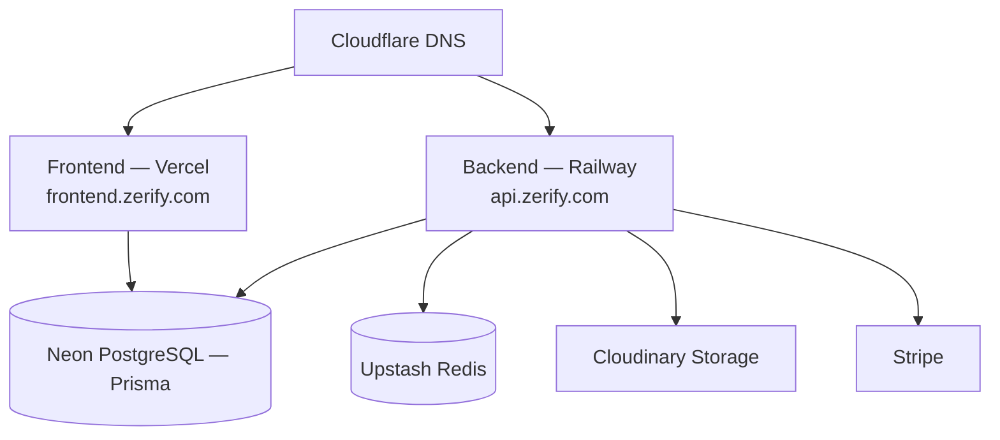

# Zerify — V1 Architecture

**Vision:** Zerify is a global SaaS platform connecting brands and influencers. The frontend and backend are fully decoupled — the frontend is just one of many possible API clients (mobile app, browser extension, public API, third-party integrations can be added later without touching the backend).

---

## 1. High-Level System Architecture



**Key principle:** The frontend *never* touches the database directly. Every operation — read or write — goes through `api.zerify.com`.

---

## 2. Backend Modules (NestJS)

```mermaid
flowchart LR
    subgraph Backend["Zerify Backend (NestJS)"]
        direction TB
        M1[Auth Module — Neon Auth Integration]
        M2[User Module]
        M3[Organization Module]
        M4[Brand Module]
        M5[Influencer Module]
        M6[Campaign Module]
        M7[Search Module]
        M8[AI Recommendation Module]
        M9[Payment Module]
        M10[Chat Module]
        M11[Notification Module]
        M12[Analytics Module]
        M13[Admin Module]
        M14[Billing Module]
        M15[File Upload Module — Cloudinary]
    end
```



Each module is **completely isolated** and contains:

```
module/
├── controller.ts
├── service.ts
├── repository.ts
├── dto/
├── entities/
├── interfaces/
├── guards/
└── validators/
```

---

## 3. Repository Structure (Monorepo)

```
zerify/
│
├── apps/
│   ├── frontend/          # Next.js — Brand + Influencer facing
│   ├── backend/           # NestJS API (api.zerify.com)
│   ├── admin/             # Next.js — internal admin panel
│   └── docs/              # Documentation site
│
├── packages/
│   ├── ui/                # Shared component library
│   ├── types/             # Shared TypeScript types
│   ├── eslint-config/
│   ├── tsconfig/
│   └── shared-utils/
│
├── infrastructure/
│   ├── docker/
│   ├── kubernetes/
│   ├── terraform/
│   └── nginx/
│
├── .github/
└── turbo.json
```

### Frontend structure (`apps/frontend`)

```
frontend/
└── src/
    ├── app/
    ├── components/
    ├── hooks/
    ├── services/
    ├── lib/
    ├── store/
    ├── types/
    ├── utils/
    └── middleware.ts
```

### Backend structure (`apps/backend`)

```
backend/
├── prisma/
│   └── schema.prisma      # Prisma ORM schema for Neon PostgreSQL
└── src/
    ├── modules/
    ├── common/
    ├── config/
    ├── database/
    ├── jobs/
    ├── workers/
    └── main.ts
```

---

## 4. Authentication Flow (Neon Auth)



---

## 5. Database Layer

**Primary DB: Neon PostgreSQL with Prisma ORM**

Core entities managed via Prisma schemas (`prisma/schema.prisma`):
- Users
- Organizations
- Brands
- Influencers
- Campaigns
- Messages
- Transactions
- Subscriptions
- Invoices
- Notifications
- Reports
- Reviews
- Contracts

**Redis (Upstash) is used for:**
- High-performance caching
- OTP storage
- Rate limiting
- Search cache
- AI cache
- Campaign cache

---

## 6. Background Job Processing



> **Rule:** Nothing heavy runs inside an API request/response cycle. Anything expensive (scraping, AI calls, report generation, bulk emails) is offloaded to a queued background worker.

---

## 7. AI Module

Fully independent module that can swap or combine model providers.



---

## 8. Search

**Phase 1 (V1 launch):** PostgreSQL Full Text Search via Prisma queries
**Phase 2 (scale):** OpenSearch

Searchable entities: Influencers, Brands, Campaigns

---

## 9. Payments



---

## 10. File & Media Storage

**Cloudinary** handles:
- Profile Images & Influencer Media
- Campaign Assets & Videos
- Dynamic Image Optimization & Transformation
- Signed Upload Tokens for secure direct client uploads
- Contracts & Invoice Documents

---

## 11. Notifications

Single unified **Notification Service** fans out to:
- Email (Resend)
- SMS
- Push
- In-App

---

## 12. API Design

Base URL: `api.zerify.com`

All routes are versioned from day one:

```
/api/v1/auth
/api/v1/users
/api/v1/brands
/api/v1/influencers
/api/v1/campaigns
/api/v1/payments
/api/v1/chat
/api/v1/search
/api/v1/admin
/api/v1/files
/api/v1/analytics
```

---

## 13. Deployment Architecture



---

## Summary of Core Principles

1. **Strict frontend/backend separation** — frontend is an API consumer.
2. **Neon Auth for Managed Authentication** — secure token management & SDK integration.
3. **Neon PostgreSQL with Prisma ORM** — type-safe database queries and migrations.
4. **Cloudinary Media Storage** — media management, optimization, and secure direct uploads.
5. **Modular, isolated backend modules** — each module is self-contained.
6. **BullMQ background workers** — asynchronous processing.
7. **Monorepo** via Turborepo, sharing types/UI/config across apps.
