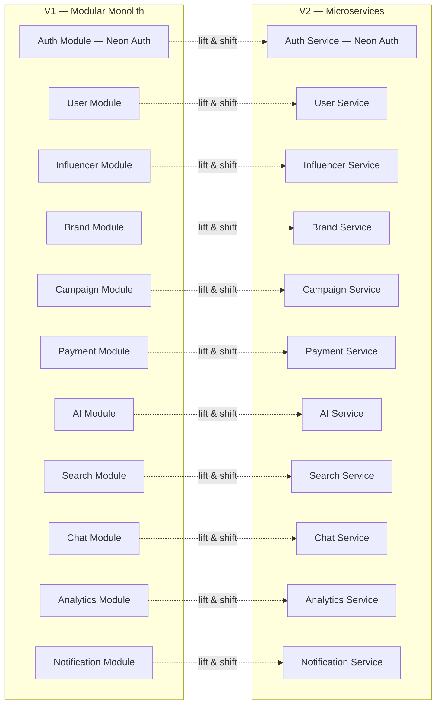
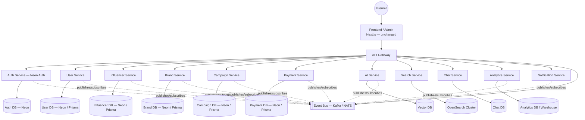
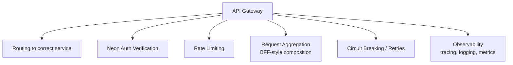
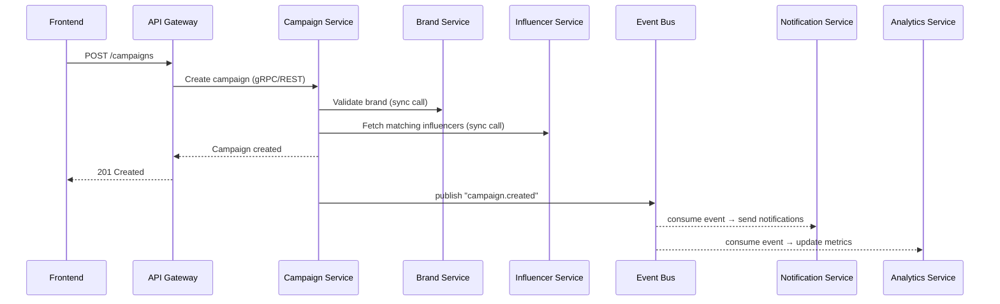
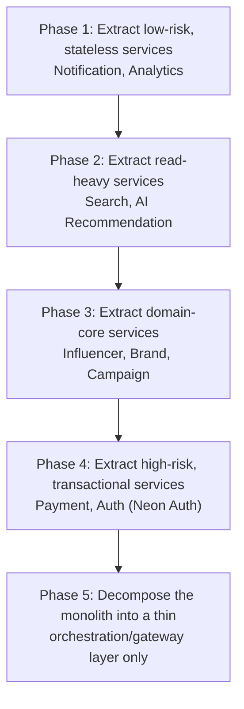
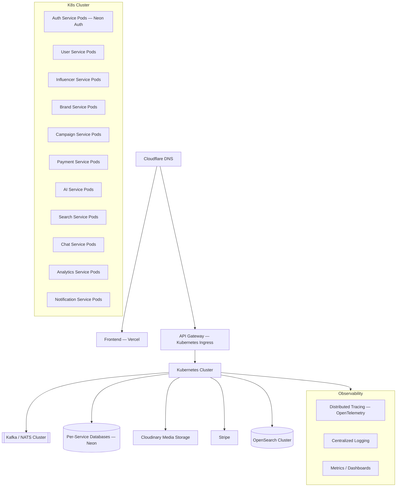

# Zerify — V2 Scaling Architecture

**Trigger for migration:** 10,000+ paying brands, or the engineering team has grown large enough that a single NestJS monolith becomes a bottleneck for independent deployment and ownership.

**Core promise:** The frontend does not change. It still talks to `api.zerify.com`. Everything below the API Gateway is what changes.

---

## 1. Why This Migration Is Incremental, Not a Rewrite

In V1, every domain (auth, users, brands, influencers, campaigns, payments, AI, search, chat, analytics, notifications) was already built as an **isolated NestJS module** with its own controller/service/repository/dto/entities. That module boundary *is* the future service boundary.

Each module already exposes a clean internal API surface (its `service.ts`), so extraction means: give it its own `main.ts`, its own deployable process, its own datastore access, and a network boundary — the business logic barely changes.

---

## 2. Target High-Level Architecture

---

## 3. API Gateway Responsibilities

The gateway becomes the single entry point and absorbs what used to be shared middleware in the monolith:

Options: Kong, AWS API Gateway, or a lightweight NestJS gateway service using `@nestjs/microservices`.

---

## 4. Service Boundaries & Data Ownership

Each service **owns its own data** — no service reaches into another service's database directly.

| Service | Owns | Talks to |
|---|---|---|
| Auth Service | Neon Auth Integration, session validation | User Service (on signup) |
| User Service | User profiles, org membership | Auth, Notification |
| Brand Service | Brand profiles, org data | User, Campaign |
| Influencer Service | Influencer profiles, social stats | Search, AI, Analytics |
| Campaign Service | Campaigns, applications, contracts | Brand, Influencer, Payment, Notification |
| Payment Service | Transactions, subscriptions, invoices, payouts | Stripe, Campaign, Billing events |
| AI Service | Recommendations, rankings, fraud scoring | Influencer, Campaign (via events, read replicas, or async requests) |
| Search Service | Search indices | Influencer, Brand, Campaign (via events) |
| Chat Service | Messages, threads | User, Notification |
| Analytics Service | Aggregated metrics, reports | All services (via event stream) |
| Notification Service | Delivery of email/SMS/push/in-app | All services (event consumer) |

---

## 5. Inter-Service Communication

---

## 6. Database Strategy: From Shared to Per-Service

```mermaid
flowchart LR
    subgraph V1DB["V1 — Single Neon PostgreSQL (Prisma)"]
        Users
        Orgs[Organizations]
        Brands
        Influencers
        Campaigns
        Transactions
        Messages
    end

    subgraph V2DB["V2 — Database-per-Service"]
        direction TB
        AuthPG[(Auth DB — Neon)]
        UserPG[(User PG — Prisma)]
        BrandPG[(Brand PG — Prisma)]
        InfPG[(Influencer PG — Prisma)]
        CampPG[(Campaign PG — Prisma)]
        PayPG[(Payment PG — Prisma)]
        ChatPG[(Chat PG)]
        AnalyticsWH[(Analytics Warehouse)]
    end

    V1DB -. "strangler-fig migration<br/>table-by-table" .-> V2DB
```

---

## 7. Recommended Migration Order

---

## 8. Deployment & Infrastructure

---

## 9. Cross-Cutting Concerns at Scale

| Concern | V1 (Monolith) | V2 (Microservices) |
|---|---|---|
| Auth | Neon Auth integration | Neon Auth validation at API Gateway & Services |
| Rate limiting | Redis, in-process | Enforced at API Gateway, per-client/per-route |
| Caching | Shared Redis | Redis per service |
| Storage | Cloudinary | Cloudinary |
| Database | Neon PostgreSQL + Prisma | Per-service Neon databases + Prisma |

---

## 10. Summary

1. **Trigger:** 10,000+ paying brands or team size demands independent deployability.
2. **Strategy:** Strangler Fig — extract module-by-module behind the existing API Gateway.
3. **Data:** Move from single Neon PostgreSQL database to per-service Neon databases via Prisma ORM.
4. **Auth & Media:** Retain **Neon Auth** and **Cloudinary** media storage across microservices.
