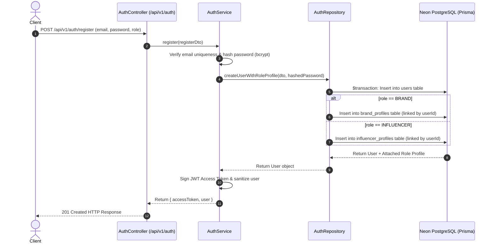

# Authentication Backend & Role-Profile System Walkthrough

I have built the entire authentication backend system in NestJS with Neon PostgreSQL integration via Prisma ORM.

---

## 1. System Architecture & Flow

---

## 2. Key Components Built

1. **[schema.prisma](file:///c:/Users/susha/OneDrive/Desktop/Zerify/apps/backend/prisma/schema.prisma)**:
   - Added `name` and `password` columns to `User` model.
   - Updated `BrandProfile` (`companyName`, `website`) and `InfluencerProfile` (`handle`, `platform`, `bio`) to support seamless automatic role profile creation.
   - Synced database schema with Neon PostgreSQL (`npx prisma db push`).

2. **[register.dto.ts](file:///c:/Users/susha/OneDrive/Desktop/Zerify/apps/backend/src/modules/auth/dto/register.dto.ts) & [login.dto.ts](file:///c:/Users/susha/OneDrive/Desktop/Zerify/apps/backend/src/modules/auth/dto/login.dto.ts)**:
   - Request validation DTOs enforcing email formats, minimum password lengths, and `UserRole` enums (`BRAND` | `INFLUENCER`).

3. **[auth.repository.ts](file:///c:/Users/susha/OneDrive/Desktop/Zerify/apps/backend/src/modules/auth/auth.repository.ts)**:
   - Isolated database access layer executing Prisma transactions (`$transaction`) to atomically create the `User` record in `users` and the corresponding profile record in `brand_profiles` or `influencer_profiles`.

4. **[auth.service.ts](file:///c:/Users/susha/OneDrive/Desktop/Zerify/apps/backend/src/modules/auth/auth.service.ts)**:
   - Handles password hashing via `bcrypt` (10 salt rounds), email duplication checks, user sanitization, and JWT token generation.

5. **[auth.controller.ts](file:///c:/Users/susha/OneDrive/Desktop/Zerify/apps/backend/src/modules/auth/auth.controller.ts)**:
   - Exposed API routes:
     - `POST /api/v1/auth/register` — Registers user & creates role profile.
     - `POST /api/v1/auth/login` — Authenticates email/password & issues JWT.
     - `GET /api/v1/auth/me` — Protected endpoint returning current user's profile and attached role details.

6. **[jwt.strategy.ts](file:///c:/Users/susha/OneDrive/Desktop/Zerify/apps/backend/src/modules/auth/strategies/jwt.strategy.ts) & [jwt-auth.guard.ts](file:///c:/Users/susha/OneDrive/Desktop/Zerify/apps/backend/src/modules/auth/guards/jwt-auth.guard.ts)**:
   - Passport JWT strategy for Bearer token authorization.

---

## 3. Verification & Testing Results

- **Database Sync**: Ran `npx prisma db push --skip-generate` — database sync completed with 0 errors.
- **Backend Build**: Executed `npm run build --workspace=@zerify/backend` — compiled NestJS TypeScript cleanly.
- **Unit Test Suite**: Ran Jest test suite `npm --prefix apps/backend run test`:
  - `PASS src/modules/auth/auth.service.spec.ts`
  - `PASS src/modules/vip-access/vip-access.controller.spec.ts`
  - `Test Suites: 2 passed, 2 total`
  - `Tests: 6 passed, 6 total`
