# Product Requirement Document (PRD)
## User Authentication & Multi-Role Onboarding — Zerify

**Status:** Draft v1
**Owner:** Product / Engineering
**Related:** [v1_architecture.md](./v1_architecture.md), [v2_scalling_architecture.md](./v2_scalling_architecture.md)

---

## 1. Overview

### 1.1 Feature Name
User Registration, Authentication & Multi-Role Onboarding

### 1.2 Objective
Enable users to create an account in under 60 seconds and progressively configure their Zerify profile according to their role — collecting only what's essential up front, and everything else later — while capturing enough structured metadata to power AI-driven matching, recommendations, and analytics from day one.

### 1.3 Supported Roles

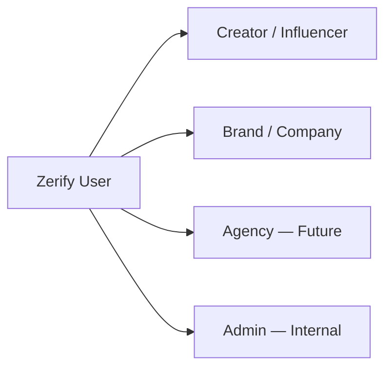

| Role | Status | Notes |
|---|---|---|
| Creator (Influencer) | V1 | Full onboarding flow defined below |
| Brand / Company | V1 | Full onboarding flow defined below |
| Agency | Future | Will likely bundle multiple Creator/Brand relationships |
| Admin | Internal | Provisioned manually, not via self-serve signup |

---

## 2. Goals & Success Metrics

### 2.1 Primary Goals
- Account creation in **< 60 seconds**
- Minimize onboarding friction — only essential fields required up front
- Allow full profile completion **later**, with visible progress tracking
- Deliver a **personalized dashboard** immediately after signup
- Capture enough metadata from the start to power **AI recommendations**

### 2.2 Success Metrics

| Metric | Target |
|---|---|
| Time to complete signup (auth only) | < 60 seconds |
| Onboarding wizard completion rate (essential steps) | > 70% |
| Full profile completion within 7 days | > 40% |
| Drop-off rate per wizard step | < 15% |
| % of creators with ≥1 connected social account after onboarding | > 80% |

---

## 3. Authentication

### 3.1 Supported Methods
- Google OAuth
- Email + Password
- Apple (Future)

### 3.2 Authentication Flow

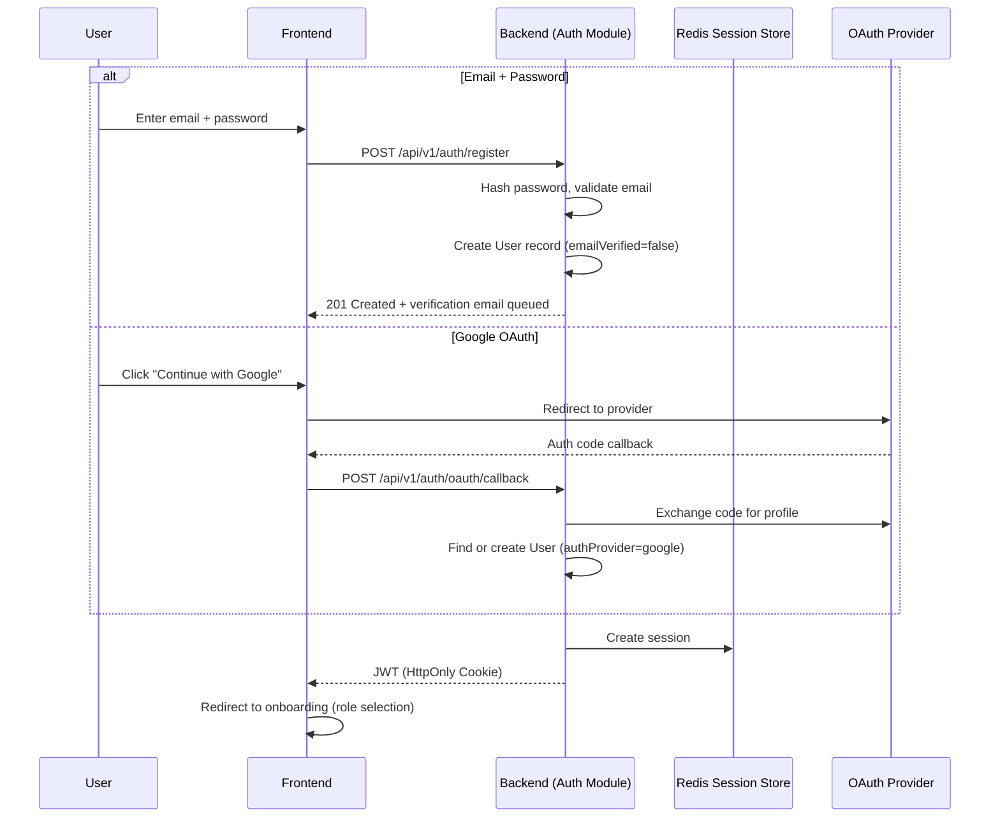

### 3.3 Email Verification Flow

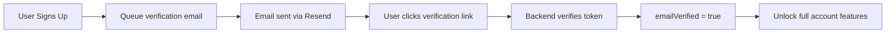

> Users can begin onboarding and explore a limited dashboard before verifying their email, but certain actions (payouts, publishing a public profile, applying to campaigns) require `emailVerified = true`.

### 3.4 `User` Table (Core Auth Entity)

| Field | Type | Notes |
|-------|------|-------|
| `id` | UUID | Primary key |
| `email` | String | Unique |
| `passwordHash` | Nullable String | Null for OAuth-only accounts |
| `authProvider` | Enum | `email`, `google`, `apple` |
| `emailVerified` | Boolean | |
| `createdAt` | Timestamp | |
| `updatedAt` | Timestamp | |
| `lastLogin` | Timestamp | |
| `role` | Enum | `creator`, `brand`, `agency`, `admin` |
| `onboardingCompleted` | Boolean | Essential steps only |
| `profileCompletedPercentage` | Integer | 0–100 |
| `accountStatus` | Enum | `active`, `suspended`, `deactivated`, `pending_verification` |

---

## 4. Onboarding — End-to-End Flow

### 4.1 High-Level State Machine

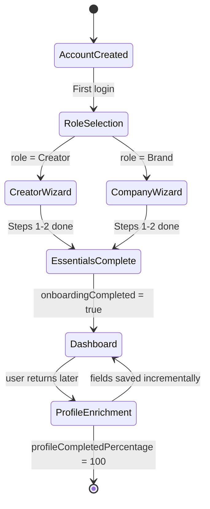

**Key principle:** Only Step 1 (role) and Step 2 (basic info) are required to reach `onboardingCompleted = true` and land on the dashboard. Steps 3+ are encouraged via a persistent progress indicator but never block access.

### 4.2 Step 1 — Welcome / Role Selection

```
Welcome to Zerify 👋
What brings you here?

○ I'm a Creator
○ I'm looking for Creators

[ Save ]
```

**Stores:** `role`

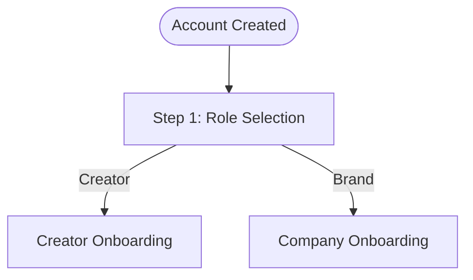

---

## 5. Creator Onboarding Flow

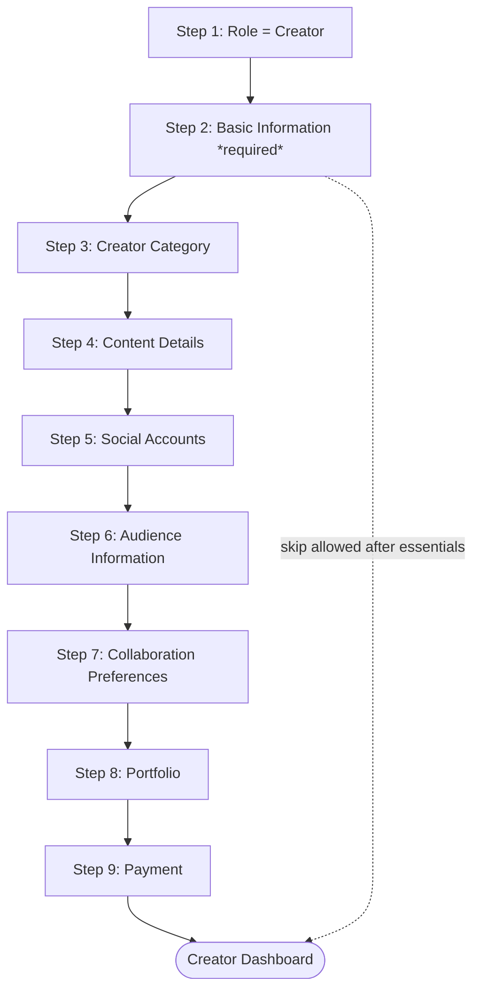

### Step 2 — Basic Information *(required to complete onboarding)*

| Field | Required |
|---|---|
| Full Name | ✓ |
| Username | ✓ |
| Profile Photo | ✓ |
| Bio | Optional |
| Country | ✓ |
| State | Optional |
| City | Optional |
| Languages | ✓ |
| Phone Number | Optional |
| Gender | Optional |
| DOB | Optional |

### Step 3 — Creator Category *(multi-select)*
Fashion, Beauty, Lifestyle, Travel, Gaming, Tech, Finance, Education, Fitness, Food, Photography, Comedy, Music, Dance, Parenting, Pets, Luxury, Automobile

**Stores:** `categories[]`

### Step 4 — Content Details

| Field |
|---|
| Primary Content Type |
| Secondary Content Type |
| Posting Frequency |
| Years of Experience |
| UGC Creator (bool) |
| Open to Affiliate Marketing (bool) |
| Open to Paid Collaborations (bool) |

### Step 5 — Social Accounts

Supports multiple accounts across: Instagram, TikTok, YouTube, LinkedIn, Twitter/X, Facebook, Pinterest, Twitch, Website.

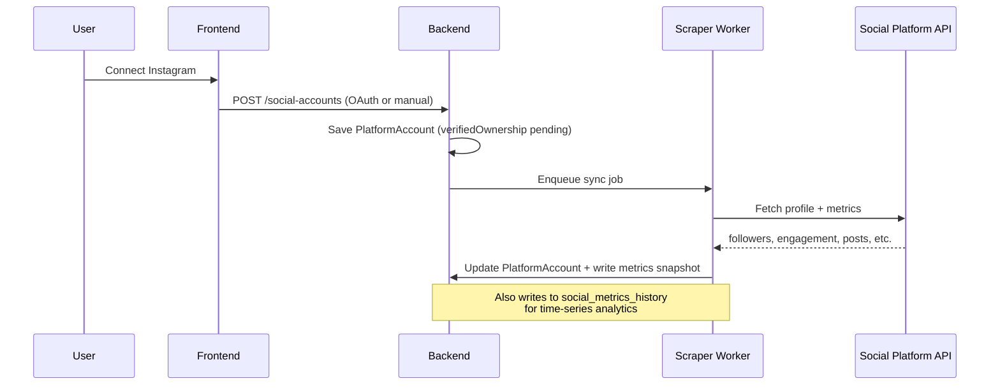

**`PlatformAccount` fields:**
`platform`, `username`, `profileUrl`, `connectedViaOAuth`, `verifiedOwnership`, `followers`, `following`, `totalPosts`, `avgLikes`, `avgComments`, `avgViews`, `avgShares`, `engagementRate`, `averageReach`, `demographics`, `lastSynced`

> These values refresh automatically via API/scraper sync jobs (see Section 8 — Analytics History).

### Step 6 — Audience Information
Audience Country, Audience Cities, Age Distribution, Gender Distribution, Top Languages, Interests — fetched automatically where possible once accounts are connected.

### Step 7 — Collaboration Preferences
Price Range, Minimum Budget, Collaboration Types (Product Exchange / Paid Promotion / Affiliate / Event Appearance / Long-term Partnership), Travel Willingness, Remote Only.

### Step 8 — Portfolio
Featured Videos, Instagram Posts, YouTube Videos, Drive Links, Media Kit, Brand Deck.

### Step 9 — Payment
Preferred Currency, Bank Details (encrypted), PayPal, Stripe, UPI, GST Number (optional).

---

## 6. Company (Brand) Onboarding Flow

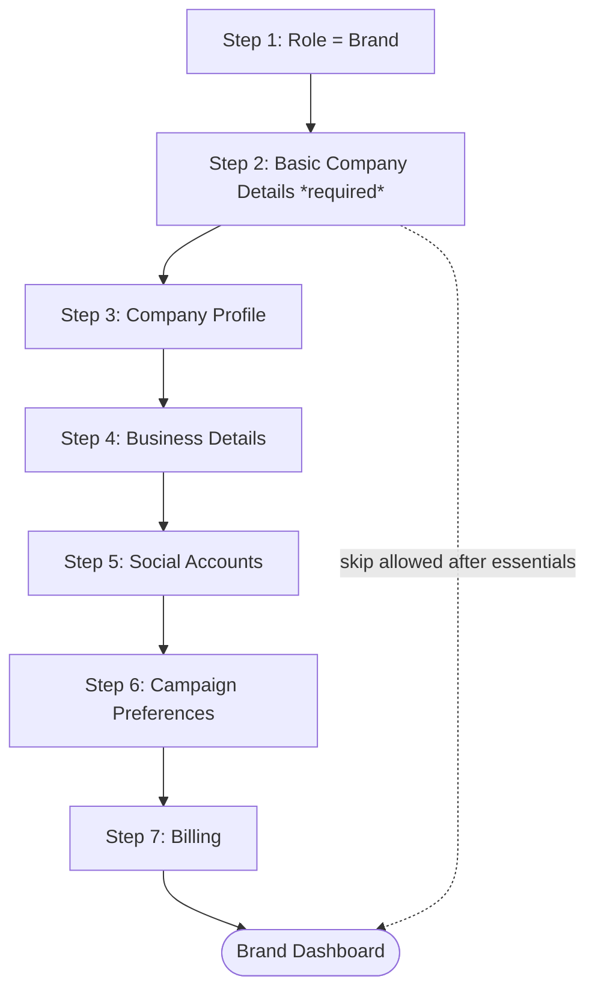

### Step 2 — Basic Company Details *(required)*
Company Name, Logo, Website, Company Email, Phone, Industry, Company Size, Founded Year, Description, Headquarters (Country/State/City).

### Step 3 — Company Profile
Company Type: Startup, SMB, Enterprise, Agency, D2C, E-commerce, SaaS, Creator Agency.

### Step 4 — Business Details
Number of Employees, Annual Marketing Budget, Monthly Influencer Budget, Average Campaign Size, Primary Market, Secondary Markets.

### Step 5 — Social Accounts
Instagram, LinkedIn, Twitter, Facebook, TikTok, YouTube, Website — stored identically to creator `PlatformAccount` records.

### Step 6 — Campaign Preferences
Preferred Creator Size (Nano / Micro / Mid / Macro / Celebrity), Preferred Categories, Preferred Countries, Preferred Languages, Campaign Types, Expected Deliverables.

### Step 7 — Billing
GST Number, Billing Address, Invoice Email, Payment Method.

---

## 7. Shared Components

### 7.1 `UserSettings` (applies to all roles)
Theme, Language, Timezone, Email Notifications, Push Notifications, SMS Notifications, Marketing Emails, Weekly Reports.

### 7.2 Profile Completion Tracking

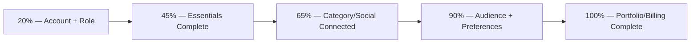

**Creator — sample missing-fields prompts:**
- Connect Instagram
- Upload Profile Picture
- Add Portfolio
- Add Pricing
- Verify Email

**Company — sample missing-fields prompts:**
- Logo
- Website
- Billing
- Campaign Preferences

The progress indicator persists on the dashboard (not just during the wizard) and drives targeted nudges (email/in-app) to close gaps over time.

---

## 8. Data Model

### 8.1 Entity Relationship Overview

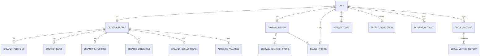

### 8.2 Suggested PostgreSQL Schema (Tables)

```
users
creator_profiles
company_profiles
social_accounts
social_metrics_history
audience_analytics
creator_portfolios
creator_rates
creator_categories
creator_languages
creator_collaboration_preferences
company_campaign_preferences
billing_profiles
payment_accounts
user_settings
profile_completion
```

### 8.3 High-Level Object Hierarchy

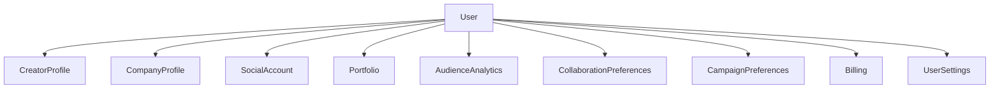

---

## 9. Future-Proofing (Store from Day One, Even If Empty)

To support Zerify's broader AI-powered platform vision, the schema should reserve fields for the following even before they're populated:

### 9.1 AI & Discovery
- Search embedding vector (semantic search)
- AI-generated creator summary
- AI-generated company summary
- Creator quality score
- Brand compatibility score
- Spam / fake-follower risk score
- Profile completeness score

### 9.2 Campaign & Collaboration History
- Total campaigns completed
- Brands worked with
- Average campaign rating
- Response rate / average response time
- Acceptance rate
- Repeat collaboration rate

### 9.3 Communication
- Preferred contact method
- Business inquiry email
- Public contact email
- Messaging preferences

### 9.4 Verification & Trust

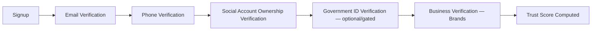

Fields: Government ID verification status, Business verification status, Social account ownership verification, Email verification, Phone verification, Trust score.

### 9.5 Analytics History (Time-Series, Not Just Latest Snapshot)

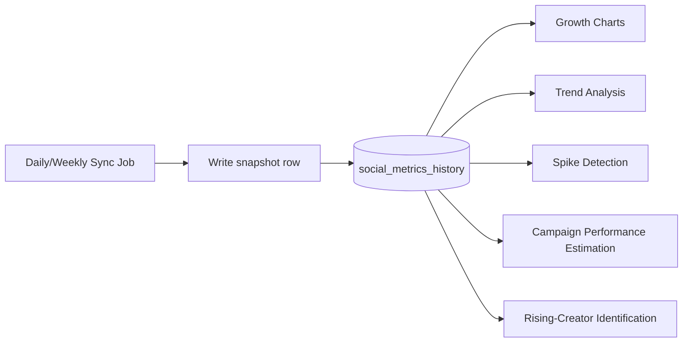

Tracked over time (not overwritten): Followers, Engagement Rate, Avg Views, Avg Likes, Reach, Estimated Impressions.

---

## 10. UX Principle: Wizard, Not a Form

- Structure onboarding as a **multi-step wizard** (5–7 concise steps), not one long form.
- Only Steps 1–2 are mandatory to reach the dashboard.
- Every subsequent step is optional but nudged via a persistent, visible completion percentage.
- This minimizes drop-off while still letting Zerify collect the rich data needed for AI matching, recommendations, campaign management, and analytics over time.

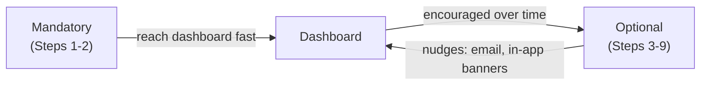

---

## 11. Open Questions / Future Considerations

- Should Agency accounts manage multiple linked Creator/Brand sub-profiles under one login?
- What's the re-verification cadence for social account ownership (e.g., re-check every 90 days)?
- Do we gate campaign applications behind a minimum `profileCompletedPercentage` threshold?
- How is `Trust Score` computed, and is it shown to the profile owner or kept internal?
- GDPR/data residency implications of storing government ID verification data — likely needs a dedicated encrypted vault, not the primary Postgres instance.
